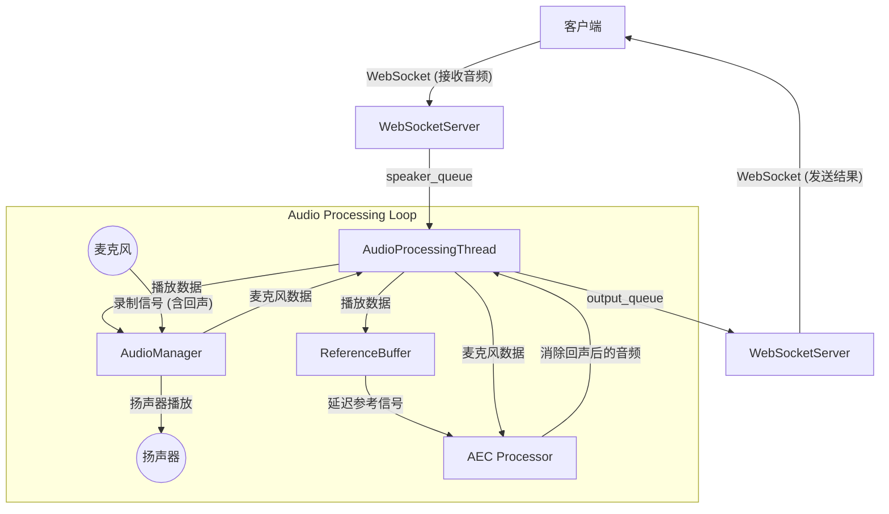

# MelodiousVoice 系统架构文档

本项目实现了一个基于 WebSocket 的实时音频处理系统，重点在于实现回声消除 (AEC) 功能。

## 1. 系统概览

本系统负责接收客户端传输的音频流，通过扬声器播放，同时录制麦克风声音（包含回声），经过回声消除处理后，将纯净的人声回传给客户端。

核心处理流程如下：
1. **网络接收**: 通过 WebSocket 接收远端音频。
2. **播放与采集**: 同步播放远端音频并采集本地麦克风信号。
3. **信号同步**: 对齐播放信号（参考信号）和录制信号。
4. **回声消除**: 使用 NKF (Normalized Kalman Filter) 算法消除回声。
5. **网络发送**: 将处理后的音频发送回客户端。

## 2. 核心组件说明

系统的主要模块如下：

### 2.1 入口与编排 (`main.py`)
系统的启动入口。
- **功能**: 解析命令行参数，初始化各子模块（音频管理器、WebSocket 服务器、处理线程），并管理主程序的生命周期。
- **关键类/函数**: 
  - `main()`: 负责组装 `AudioManager`, `WebSocketServer`, `AECProcessor`, `AudioProcessingThread` 并启动它们。

### 2.2 音频设备管理 (`audio_manager.py`)
封装了 `PyAudio` 库，提供统一的音频 I/O 接口。
- **功能**: 管理音频设备的枚举、初始化、流的开启与关闭，以及最关键的**同步读写**操作。
- **关键类**: `AudioManager`
  - `read_write_chunk(output_chunk)`: 核心方法。在写入一块音频数据到扬声器的同时，从麦克风读取一块数据，最大程度保证输入输出的时间对齐。

### 2.3 实时处理线程 (`audio_processing_thread.py`)
系统的“心脏”，负责连接各个模块的管道。
- **功能**: 在独立线程中运行音频处理循环，避免阻塞网络 I/O。
- **工作流程**:
  1. 从 `speaker_queue` 获取待播放音频。
  2. 将音频存入 `ReferenceBuffer` 作为 AEC 的参考信号。
  3. 调用 `audio_manager.read_write_chunk` 进行播放和录制。
  4. 从 `ReferenceBuffer` 获取经过延迟补偿的参考信号。
  5. 调用 `aec_processor` 进行回声消除。
  6. 将结果放入 `output_queue` 供发送。
- **关键类**: `AudioProcessingThread`

### 2.4 网络通信 (`websocket_server.py`)
处理与客户端的 WebSocket 连接。
- **功能**: 接收客户端上传的音频数据并放入播放队列，同时从输出队列取出处理后的音频发送回客户端。
- **关键类**: `WebSocketServer`

### 2.5 回声消除核心 (`aec_processor.py` & `nkf.py`)
实现回声消除算法。
- **`aec_processor.py`**: Aec 处理器的封装层，负责调用具体的算法模型。
- **`nkf.py`**: 实现了具体的 NKF (Normalized Kalman Filter) 算法或深度学习模型（如 DeepVQE），用于从麦克风信号中减去参考信号（回声）。

## 3. 数据流向图

## 4. 开发指南

- **添加新算法**: 若要测试新的 AEC 算法，只需修改 `aec_processor.py` 中的 `process_chunk` 方法，或新增一个 Processor 类并在 `main.py` 中替换即可。
- **调整延迟**: 系统支持自动延迟估计（通过 `--align` 参数），也可以在 `main.py` 或启动参数中手动指定延迟（`--delay`），这对于由于硬件缓冲区导致的固定延迟非常重要。
